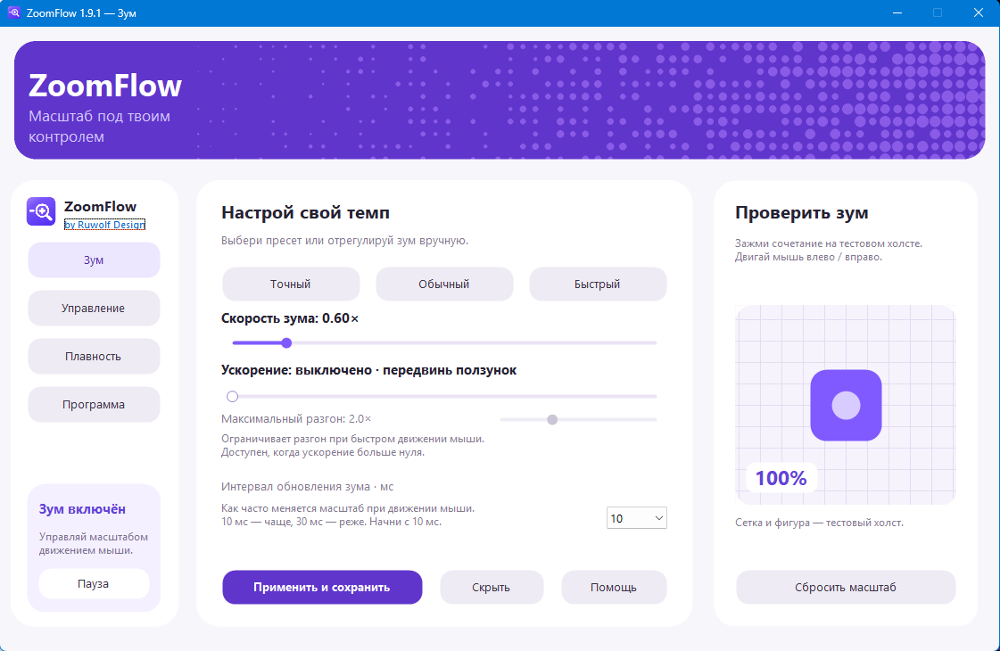

# ZoomFlow

Плавное масштабирование движением мыши для Windows.

[**Скачать ZoomFlow 1.9.1 для Windows**](https://github.com/evge92rudolf/ZoomFlow/raw/refs/heads/main/downloads/ZoomFlow-1.9.1.exe)



## Как появился проект

ZoomFlow начался как небольшой AutoHotkey-скрипт Zoom Drag: хотелось управлять масштабом в дизайнерских программах, удерживая Ctrl и колёсико мыши и двигая мышь. Постепенно идея превратилась в отдельную утилиту с настройками скорости, плавности и инерции.

Проект создан Евгением Рудольфом, дизайнером, совместно с ChatGPT / Codex. Интерфейс развивался через последовательные правки и тестирование: появились фирменный фиолетовый стиль Design Flow, состояние паузы и тестовый холст, где можно попробовать зум до работы в других приложениях. Так Zoom Drag получил новое имя — **ZoomFlow**.

## Возможности

- Зум при удержании сочетания клавиш и движении мыши.
- Настройка скорости, ускорения, сглаживания и инерции.
- Выбор вертикальной или горизонтальной оси и обратного направления.
- Настраиваемые клавиши и кнопка мыши.
- Пауза, автозапуск и сохранение настроек.
- Тестовый холст с фигурой, сеткой и отображением масштаба.

## Запуск

1. Скачайте EXE по ссылке выше.
2. Запустите программу — отдельная установка AutoHotkey для EXE не требуется.
3. По умолчанию удерживайте **Ctrl + среднюю кнопку мыши (колёсико)** и двигайте мышь.
4. Откройте настройки через значок в трее или **Ctrl + Alt + Z**.

Выход: **Ctrl + Alt + Esc**. Перед запуском новой версии закройте предыдущую.

Отклик зависит от приложения: ZoomFlow отправляет команды колеса мыши. Adobe Illustrator по умолчанию исключён.

## Исходный код

`src/ZoomFlow.ahk` — текущий исходник 1.9.1. Обновлена компоновка: широкий баннер и три карточки настроек. Исправлена отрисовка тестового холста, процент масштаба отображается внутри него. Подпись «by Ruwolf Design» открывает Instagram автора. Иконка с лупой сохранена.

Готовый EXE 1.9.1 доступен по ссылке вверху. Файл загружен в том виде, в котором его предоставил автор; повторная сборка при публикации не выполнялась.

Для запуска исходника нужен **AutoHotkey v2**. Для ручной сборки EXE используется **Ahk2Exe**.

## Загрузка и SmartScreen

EXE версии 1.9.1 предоставлен автором проекта. Это неподписанная сборка: Windows SmartScreen может показать предупреждение о неизвестном приложении.

SHA-256 файла `ZoomFlow-1.9.1.exe`:

```text
bebba88b41ff0f03a28e1ea9defe339f78ae8b74dad66f6f996895db81213cd7
```

## Автор

Евгений Рудольф · Design Flow / RUWOLF DESIGN  
[Сайт](https://ruwolfdesign.pro/) · [Behance](https://www.behance.net/evge92rudolf)
